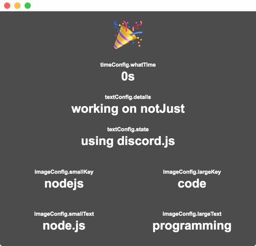

[](https://discord.gg/MpnbrX7)
[]()
[]()
[]()

[]()

# EasyRPC
### EasyRPC is an Electron app for macOS, Windows, and Linux that allows users to easily set their Discord Rich Presence Status.
### It has a config for default strings, which can then be changed through the app at any time.

## Setup
1. Copy the file `config.json.example` to `config.json`
2. Just install all requirements by using `npm i`

## Usage
1. Make sure Discord is open and running, with no other Rich Presence currently set (check this by checking your own profile in the desktop app, there should be no "playing", "streaming", "watching", or "listening" status)
2. Open Terminal or a command line and go to the app's folder: `cd EasyRPC-master`
3. When you're in the folder, do `npm run start` to start the app. The app should open and focus
4. In the app, you'll see some default text. You can change the text shown on your Rich Presence by clicking and changing the text. These will update every 15 seconds.
5. Your rich presence should now be visible to you (via the desktop app) and any other users who look at your profile

## Customization
### Changing Default Text
1. Open `config.json` with a good text editor
2. Change the `textConfig` text and `smallText`/`largeText` to the text you'd like to show on your Rich Presence by default
3. Restart the app by doing Ctrl-C and `npm run start` again to see the new default text

### Changing Images
1. Go to [this page](https://discordapp.com/developers/applications/me) and create an app. The name you choose will show up in place of the default `programming`.
2. Creating it will give you a "`Client ID`", open `config.json` and put it for the `clientID`
3. Scroll down to the bottom of the app page and Enable Rich Presence
4. Upload an image as "small" and an image as "large"
5. Put whatever you called them when uploading them (for example, `large`) for the `smallKey` and `largeKey` within `imageConfig` in `config.json` *(Note: You can put `none` for `smallKey` to only have a large image)*
6. Start EasyRPC again with `npm run start` and enjoy your new images!

### EasyRPC As A Package
EasyRPC now supports building it as a package/app, which allows you to run and use it without the CLI. Make sure you do all necessary configuration and image options, as you can't change default text and image configs without re-packaging.
1. Run `npm install electron-packager -g` in the folder where you have EasyRPC's files
2. Run `electron-packager .` to package EasyRPC
3. You should find your app, native for the platform you are currently on, inside a new folder. The folder is named in the output:
```Wrote new app to /Foo/Bar/EasyRPC/EasyRPC-darwin-x64```
4. Go inside the folder and run the app. 
5. You should see the EasyRPC app working, with it's customization UI. As noted above, this will set your rich presence, and you can edit the text through this app, but some configs cannot be changed after packaging, unless you package again.

## Thanks
Thanks to **[devsnek](https://github.com/devsnek)** for his original Rich Presence example, which helped with much of the base code used for EasyRPC.
Thanks to **Rung#9946** for the `Changing Images` documentation.
